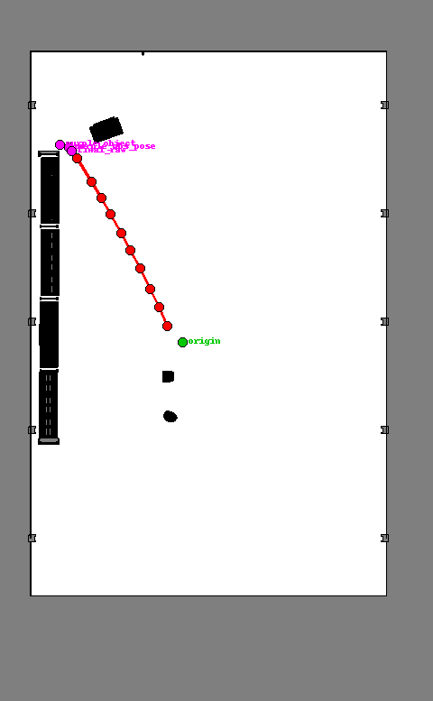
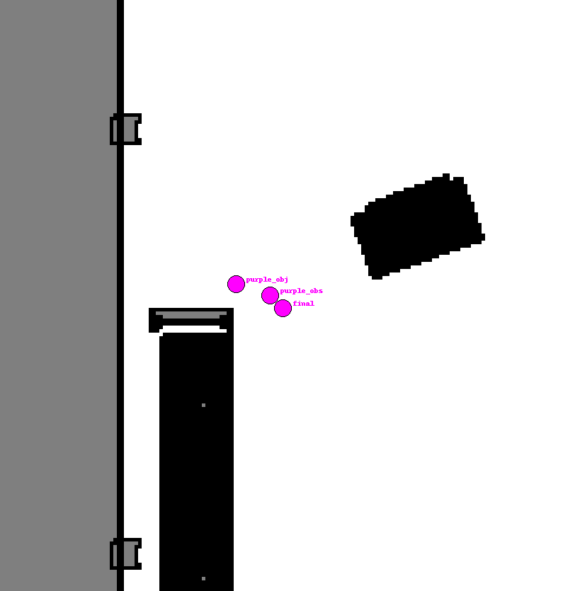
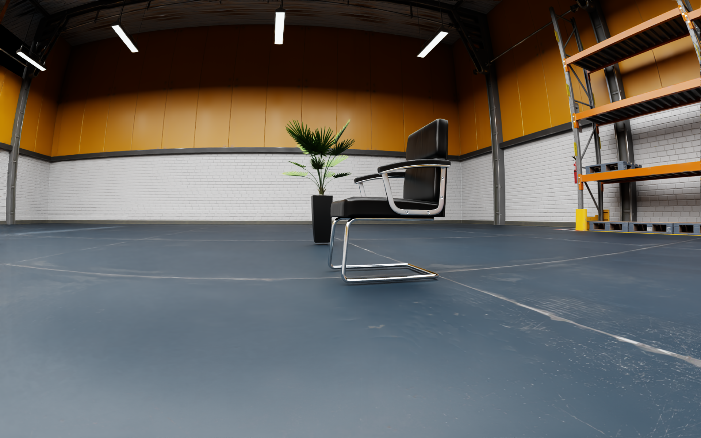
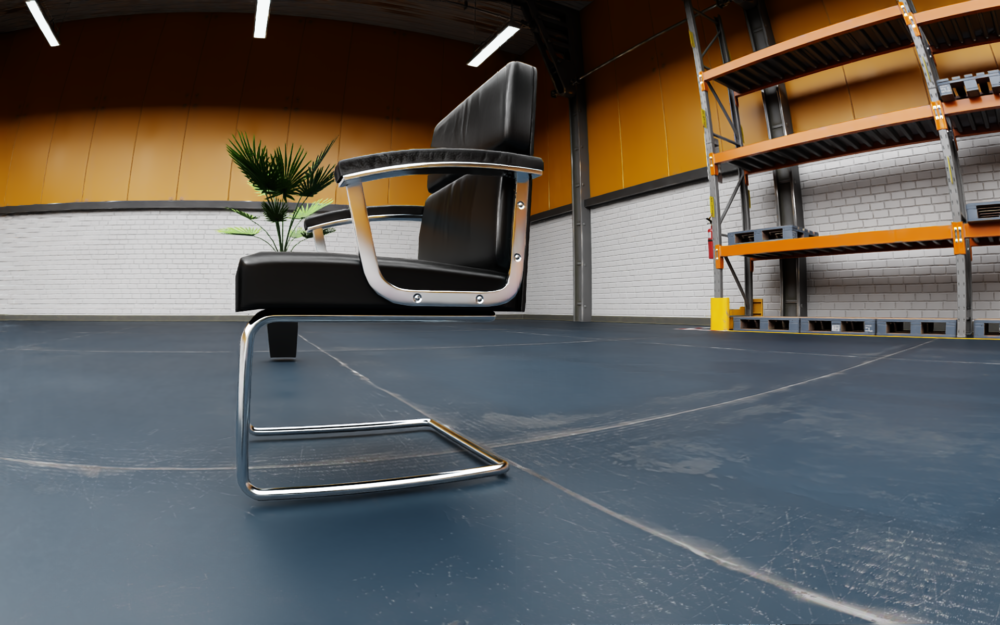
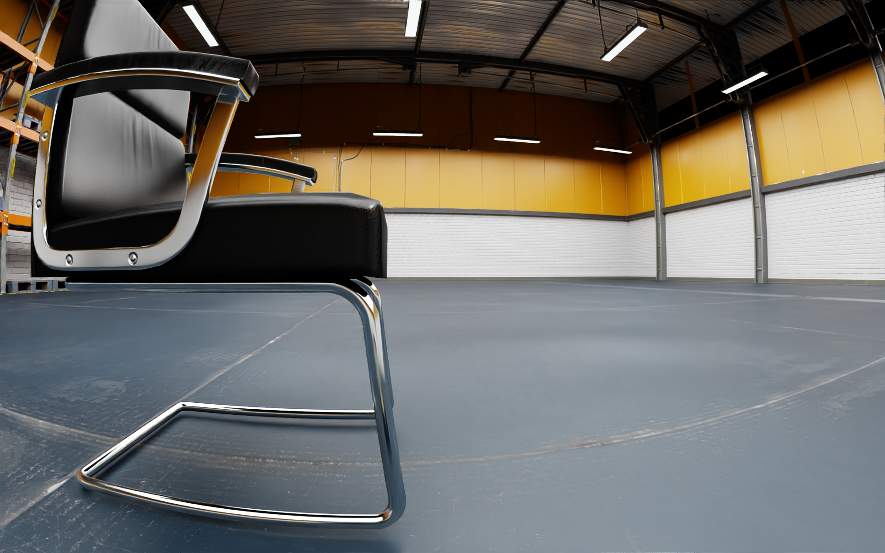
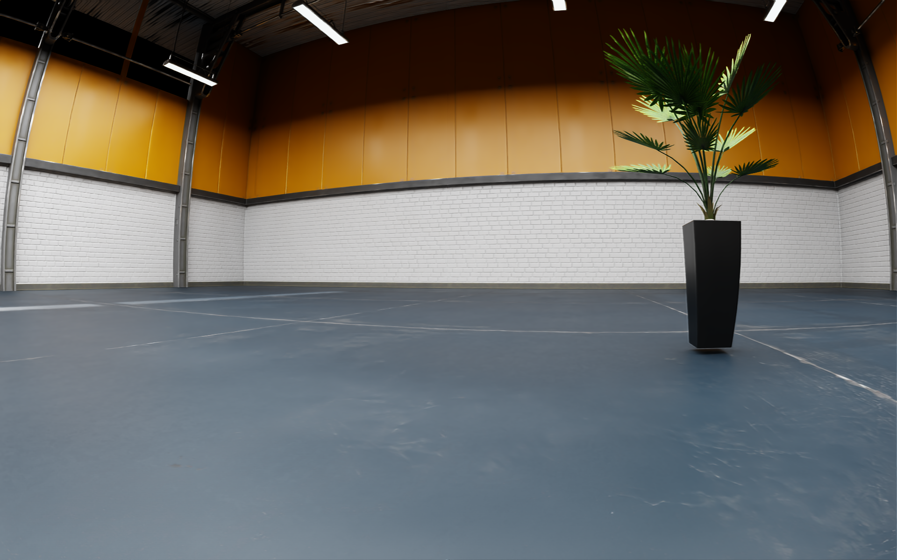
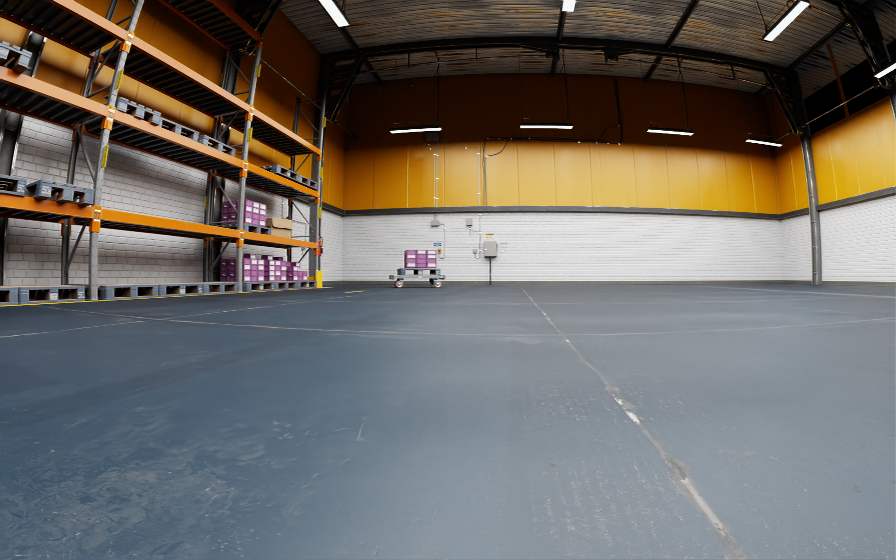

# ZhiruiSHEN-VLN

<p align="center">
  <a href="#zh">🇨🇳 中文</a>
</p>

重启电脑后可先参考环境快速恢复手册：[reset.md](reset.md)

## 当前进度总览（2026-06-23）

| 节点 | 状态 | 主要产出 |
|---|---|---|
| Node 1-5 | 已完成 | Isaac Sim/ROS 2 通信、Nav2 基础导航、本地 Qwen3-VL 感知、VLN-Nav2 bridge。 |
| Node 6 | 已完成 | 15 条 integrated simulation evaluation、最终 CSV、failure taxonomy、复现实验报告和结果图表。 |
| Node 7 | 已完成 | 指标拆分、shelf/package 语义确认修复、safe-start/safe-goal/dynamic timeout、ablation report 和 safe recovery replay。 |
| Node 8 | targeted case 已打通，AMCL 待继续 | Nav2 长距离导航调参：motion-compensated rolling scan + RPP + odom-truth baseline 已完成 origin -> purple boxes，并通过 strict final visual confirmation；AMCL 长距离定位仍需继续修。 |
| Node 9 | 待开始 | 迁移到实体机器人并整理部署指南。 |

Node 6/7 已经收尾，不需要继续按 Node 6 blocker 重跑。2026-06-23 起，Node 8 的优先级调整为 Nav2 长距离导航调参：先解决 shelf/package/purple boxes 等远距离目标只能近距离成功的问题，再整理最终报告和 poster 材料。已有仿真证据仍基于以下文件：

```text
data/node6_auto_trials_2026-06-13_final.csv
data/node7_ablation_2026-06-13.csv
data/node7_safe_navigation_checks_2026-06-13.csv
data/node7_safe_recovery_replay_2026-06-15.csv
data/node7_online_trials_clean_2026-06-15.csv
docs/node6_final_report.md
docs/node7_ablation_report.md
docs/node7_safe_recovery_note.md
docs/node7_online_clean_rerun_report.md
docs/literature_alignment_note.md
docs/node7_observation_pose_note.md
docs/final_simulation_report.md
docs/node8_evidence_matrix.md
docs/node8_long_distance_status_2026-06-24.md
docs/node8_long_distance_status_2026-06-24.docx
docs/data_inventory_2026-06-24.md
docs/status_transfer_2026-06-16.txt
logs/week(2026-06-22-2026-06-28).md
```

### Node 6/7 最终结果摘要

| 指标 | 结果 | 说明 |
|---|---:|---|
| Node 6 strict bridge success | 7/15 | 原始严格确认逻辑下的端到端成功数。 |
| Node 6 physical arrival | 11/15 | 机器人末端位姿进入 0.8 m 成功半径。 |
| Node 7 offline optimized task success | 11/15 | 基于 Node 6 final CSV 的指标拆分 + shelf/package relaxed confirmation 离线复算。 |
| Node 7 clean online task success | 8/15 | 2026-06-15 完整在线 clean rerun，严格 visual task success。 |
| Node 7 clean online physical arrival | 13/15 | 同一在线 rerun 中最终位姿进入 0.8 m 成功半径。 |
| Node 7 observation-pose targeted task success | 5/6 | 2026-06-15 clean targeted rerun，plant/chair observation pose 验证。 |
| Node 7 relaxed shelf confirmations | 4 | 修复 Trials 8-11 的 shelf/package 语义确认 undercount。 |
| Node 7 offline remaining failures | 4/15 | 离线复算中仍未解决的模糊目标或视觉/语义地图确认失败。 |
| Node 7 clean online strict failures | 7/15 | 在线严格 task failure；其中 5/7 已到达目标半径但视觉确认失败，2/7 为模糊目标拒绝。 |

关键图表：

```text
assets/node6_target_vs_final_pose.png
assets/node6_failure_taxonomy.png
assets/node7_ablation_comparison.png
```

补充说明：Node 7 的 A/B/C ablation 是对固定 Node 6 final CSV 的离线 metric/logic ablation，不代表三组完整在线重跑。完整在线证据见 `data/node7_online_trials_clean_2026-06-15.csv` 和 `docs/node7_online_clean_rerun_report.md`。

2026-06-15 已完成 Node 7 clean online rerun。严格 task success 为 8/15，最终位姿进入 0.8 m 半径为 13/15。该结果可用于 poster/paper，但必须同时报告 physical arrival 与 visual task success，不能写成完美 15/15。

2026-06-16 的最新 full clean observation-pose evaluation 是当前更保守的长距离导航 baseline：严格 task success 为 5/15，physical arrival 为 6/15，visual confirmed 为 6/15。不要把 2026-06-15 targeted plant/chair 的 5/6 结果写成 full 15-trial 结果。

### Node 8 Nav2 长距离调参依据

当前长距离失败更像 localization / controller / costmap 闭环问题，而不是单纯 VLM 量化问题。2026-06-16 targeted health test 中，`Go to the purple boxes.` 最终 AMCL pose 为 `(-3.105, 3.495)`，raw odom 为 `(-1.226, 5.745)`，AMCL/odom disagreement 达到 `2.932 m`，最终误差 `7.973 m`。

第一轮 Nav2 修改见 `config/nav2_params_custom.yaml`：`controller_server.FollowPath` 已从 DWB (`dwb_core::DWBLocalPlanner`) 切换为 Regulated Pure Pursuit (`nav2_regulated_pure_pursuit_controller::RegulatedPurePursuitController`)。RPP v1 暴露出 slow rotate-to-heading 导致几乎不动的问题；RPP v2 关闭 `use_rotate_to_heading` 后可以持续移动，但 2026-06-23 purple-box health test 仍出现 AMCL/odom disagreement `9.094 m`，所以后续重点转向 AMCL scan update 和粒子滤波稳定性。对应 CSV：

```text
data/node8_rpp_purple_boxes_health_2026-06-23.csv
data/node8_rpp_v2_purple_boxes_health_2026-06-23.csv
```

参考来源：

- Nav2 Regulated Pure Pursuit 配置：<https://docs.nav2.org/configuration/packages/configuring-regulated-pp.html>
- Nav2 Regulated Pure Pursuit 插件源码：<https://github.com/ros-navigation/navigation2/tree/main/nav2_regulated_pure_pursuit_controller>
- Regulated Pure Pursuit 论文：<https://arxiv.org/abs/2305.20026>
- Nav2 AMCL 配置：<https://docs.nav2.org/configuration/packages/configuring-amcl.html>
- Nav2 costmap / inflation tuning：<https://docs.nav2.org/tuning/index.html>

### Node 8 最新状态（2026-06-24）

当前结论：Node 8 的 purple-box targeted 长距离链路已经完成一次 strict active-visual AMCL reanchor 成功；同时 odom-truth localization baseline 也可复现。注意这不是纯 AMCL scan matching 独立稳定成功，scan-only AMCL 长距离定位仍是当前 limitation。严格 VLN task success 仍必须是 `navigation_arrived AND visual_confirmed`，仅 Nav2 到达不能算最终成功。

### Node 8 更新：AMCL + 主动视觉重锚 strict 成功（2026-06-24）

2026-06-24，Node 8 `origin -> purple boxes` 长距离 targeted case 已在 AMCL 路线下完成一次 strict VLN 闭环：

```text
data/node8_active_visual_reanchor_final_search_2026-06-24.csv
```

核心结果：

| 指标 | 结果 |
|---|---:|
| `nav_result` | `success` |
| `navigation_arrived` | `True` |
| `final_visual_confirmed` | `True` |
| `task_success` | `True` |
| final raw error | `0.255 m` |
| final AMCL/raw disagreement | `0.077 m` |
| max AMCL/raw disagreement | `1.570 m` |
| AMCL reanchor count | `10` |

本次成功不是纯 AMCL scan matching 独立稳定成功，而是以下闭环共同作用：

- 起点主动视觉旋转，识别到 `purple boxes` 所在视觉扇区；
- 视觉命中后允许 AMCL re-anchor 到 Isaac raw odom；
- 长距离导航中监控 AMCL/raw disagreement，超过阈值后重锚；
- 到达物理半径后执行 final active visual search；
- final search 第 4 个视角确认 `purple boxes`，confidence `0.95`。

因此当前可写结论是：Node 8 long-distance strict VLN targeted case 已跑通；但 AMCL scan-only 长距离稳定性仍是 limitation。

AMCL 地图诊断图：



该图把 origin、purple-box 目标、最终位姿和导航中 reanchor 点投影到 `warehouse_map.png` 上。检查结果显示目标点、最终点和 reanchor 路径都在 free cell 内，因此问题不是“目标点在障碍物里”。更可能的问题是静态 occupancy map 对 shelf / forklift / purple-box 区域表达过粗，和 Isaac rolling `/scan` 看到的真实几何不一致，导致 AMCL likelihood-field 在后段 shelf/corridor 区域被错误 scan-map match 拉偏。

局部目标区裁剪图：



下一步如果继续修 AMCL，应优先做 scan-map residual 诊断或重建/修正 occupancy map；如果不重建地图，则保留 visual-anchor gated reanchor 作为对地图不一致的鲁棒补偿。

2026-06-24 收束报告已新增：

```text
docs/final_simulation_report.md
```

该报告把 Node 6/7 的 15-trial benchmark、Node 8 odom-truth targeted 成功、2026-06-24 strict active-visual AMCL reanchor 成功、失败的 scan-only AMCL CSV、以及地图诊断分开记录。当前可写进 poster 的 Node 8 结论是 targeted strict VLN closure with visual-anchor gated AMCL reanchoring，不是 scan-only AMCL-localized full 15-trial completion。

Node 8 证据矩阵见：

```text
docs/node8_evidence_matrix.md
```

2026-06-24 长距离 AMCL 继续调参的中英文报告素材：

```text
docs/node8_long_distance_status_2026-06-24.md
docs/node8_long_distance_status_2026-06-24.docx
```

2026-06-23 20:23 CST 追加：bridge 已加入 `semantic_nav_first_enabled`。对已知远距离语义目标，系统会先导航到 semantic observation pose，再做 final visual scan；不再从起点先做 8-step 360-degree visual scan。这个策略与 VLFM / VL-Nav / 3D-Aware ObjectNav 中“移动过程中收集视觉证据、到达候选区后确认目标”的思路一致，但本项目仍保持严格成功条件：`task_success = navigation_arrived AND final_visual_confirmed`。

同次修复还禁止 live camera 配置下回退到静态测试图：如果 `image_topic` 或 `compressed_image_topic` 已配置但没有新鲜 live image，bridge 会报错，而不会使用 `data/test_samples/warehouse_photo1.png` 作为视觉证据。这样避免“视觉 confirmed”来自静态图片而不是 Isaac 当前相机。

本次现场验证结果：

- 已验证：`semantic_nav_first` 分支生效，日志显示 `Skipping initial visual scan; final visual confirmation remains required.`
- 已验证：代码语法检查和 `colcon build --packages-select vln_nav2_bridge --symlink-install` 通过。
- 未完成：当前非 clean 状态下，Nav2 从 raw odom 约 `(0.40, -1.44)` 出发仍向远离目标方向漂移，45 秒 stuck 后 retry 仍无有效进展；该 run 被手动中断，不能计入成功。
- 下一次必须从 clean Isaac reset/origin/yaw 状态重新测试单条 purple-box strict run，再扩展 6 条 subset 和 full 15 条。
- push 前清理：删除了本地 rerun 用的 runtime instruction 临时文件和 Python `__pycache__`；保留 README/logs 直接引用的 Node 8 CSV 证据文件。

新增实现：

- `src/vln_nav2_bridge/vln_nav2_bridge/node8_scan_accumulator.py` 从 v1 更新为 motion-compensated accumulator：
  - incoming `/front_3d_lidar/lidar_points` 先转到固定帧 `fixed_frame=odom`；
  - 发布 `/scan` 前再转到当前 `target_frame=base_link`；
  - 高度过滤和 LaserScan 投影在当前 `base_link` 下完成。
- 这样避免旧版本把历史点云缓存为旧 `base_link` 坐标，导致移动/转弯时产生 scan 拖影。

配置更新：

- `amcl.transform_tolerance` 从 `2.0` 降到 `0.2`，解决 Nav2 重启后 `map->base_link` 查 TF 时被 future-dated `map->odom` 卡住的问题。
- `global_costmap.plugins` 改为 `["static_layer", "inflation_layer"]`，不再把 rolling `/scan` 作为 global obstacle source；rolling scan 保留给 AMCL 和 local costmap。
- v4 曾重新启用 RPP `use_rotate_to_heading: true`，但 clean reset 后只产生长时间纯旋转，raw odom 几乎不平移，AMCL 却漂移超过 1 m，因此该方向已废弃。
- 当前 v5 配置为 `use_rotate_to_heading: false`，并把 AMCL 更新阈值调为 `update_min_a: 0.15`、`update_min_d: 0.08`。
- 当前定位诊断配置已切到 odom-truth baseline：`amcl.tf_broadcast: false`。运行 Nav2 前必须额外启动 static `map -> odom` identity TF。

最新验证记录：

- reset/origin 长距离 pure Nav2 曾在约 `243 s` 后中断：
  - feedback 约 `13.16 m`
  - AMCL 约 `(1.91, 0.67)`，raw odom 约 `(-0.65, 2.40)`
  - AMCL/odom disagreement 约 `3.08 m`
- motion-compensated accumulator 后，当前位置 scan 质量为 `723/723` finite beams。
- 中途污染状态下的两次继续测试仍未到达目标：
  - global obstacle layer enabled：约 `406 s` 中断，目标误差仍约 `8.4 m`
  - global static-only：约 `106 s` 中断，目标误差仍约 `8.4-8.8 m`
- 这些中途测试只能说明配置方向和问题现象，不能替代 clean reset/origin 验证。
- 2026-06-23 reset 后的 v4 clean test 证明 rotate-to-heading 不适合当前 Isaac setup：
  - `cmd_vel` 约为纯旋转 `linear.x=0.0, angular.z=0.125`
  - raw odom 仍接近 origin
  - AMCL 发生虚假平移，AMCL/odom disagreement 达到约 `1.12 m`
- v5 current-pose recovery test 写入：

```text
data/node8_scan_accum_v5_no_rotate_tight_amcl_pure_nav2_from_current_to_purple_boxes_2026-06-23.csv
```

  - `result=timeout`
  - final AMCL error `0.618 m`
  - final raw odom error `2.723 m`
  - AMCL/odom disagreement `2.608 m`
  - 结论：Nav2/AMCL 认为接近目标，但物理车体没有到达，因此严格失败。
- odom-truth baseline 从 clean reset/origin 到 purple boxes 已成功：

```text
data/node8_odom_truth_baseline_from_origin_to_purple_boxes_2026-06-23.csv
```

  - result: `success`
  - target: `(-6.3, 10.8)`
  - final raw odom: `(-6.082, 10.529)`
  - final raw odom error: `0.348 m`
  - final Nav2 feedback distance: `0.365 m`
  - 结论：controller/costmap/rolling scan 在 `map -> odom` 稳定时可以完成长距离物理导航；主要 blocker 已定位为 AMCL scan localization，而不是 RPP 控制器本身。

- strict active visual bridge 随后在目标区域通过：
  - instruction: `Go to the purple boxes.`
  - `nav_result=success`
  - `navigation_arrived=True`
  - `visual_confirmed=True`
  - `task_success=True`
  - `confidence=0.95`
  - `parse_method=semantic_explore_final_visual_confirmed`
  - final image:

```text
data/runtime/trial_images/trial_0013_20260623_180722_187547852_scan_05_go_to_the_purple_boxes.png
```

  - result row appended to:

```text
data/node6_trials.csv
```

  - 人工检查最终图像：purple boxes 位于画面左侧，部分被黄色货叉/护栏遮挡，但目标可见；该结果满足 `navigation_arrived AND visual_confirmed`。

- Isaac Sim 重启后复现：

```text
data/node8_reboot_odom_truth_pure_nav2_origin_to_purple_boxes_2026-06-23.csv
data/node8_reboot_odom_truth_return_to_origin_retry_2026-06-23.csv
```

  - reboot origin -> purple boxes:
    - `result=success`
    - final raw odom `(-6.085, 10.532)`
    - raw target error `0.343 m`
    - feedback distance `0.365 m`
  - reboot strict visual:
    - `navigation_arrived=True`
    - `visual_confirmed=True`
    - `task_success=True`
    - confidence `0.95`
    - final image:

```text
data/runtime/trial_images/trial_0009_20260623_184124_788871813_scan_01_go_to_the_purple_boxes.png
```

  - return-to-origin retry:
    - `result=success`
    - final raw odom `(-0.210, 0.273)`
    - raw origin error `0.345 m`

- AMCL-owning Nav2 reboot test remains failed:

```text
data/node8_reboot_amcl_tf_broadcast_pure_nav2_current_to_purple_boxes_2026-06-23.csv
```

  - `result=timeout`
  - final raw odom `(-1.002, 7.535)`
  - final AMCL pose `(-5.186, 7.221)`
  - raw target error `6.223 m`
  - AMCL target error `3.748 m`
  - AMCL/raw disagreement `4.197 m`
  - conclusion: AMCL scan matching still drifts in the shelf/corridor region.

New AMCL test config:

```text
config/nav2_params_amcl_test.yaml
```

  - `amcl.tf_broadcast=true`
  - no static `map -> odom` should be active for this mode
  - conservative scan model for next pass:
    - `laser_likelihood_max_dist: 1.5`
    - `sigma_hit: 0.30`
    - `z_hit: 0.35`
    - `z_rand: 0.55`
  - QoS note: AMCL subscribes to `/initialpose` with `BEST_EFFORT`; initial-pose publishers must match that QoS or AMCL may ignore the pose.

下一步：

1. 保留 2026-06-24 strict active-visual AMCL reanchor CSV 和 final visual image 作为 Node 8 purple-box targeted 成功链路。
2. 保留 odom-truth baseline 作为可复现的导航控制正证据。
3. 如果继续修 scan-only AMCL，优先检查 `/scan` 与静态地图 residual，而不是继续盲调 AMCL 参数。
4. 后续需要扩展到 full 15-instruction rerun，不能用单条 purple-box targeted case 代表完整 benchmark。

补充来源：

- ROS 2 `pointcloud_to_laserscan` target frame 参考：<https://docs.ros.org/en/ros2_packages/humble/api/pointcloud_to_laserscan/__README.html>
- Nav2 obstacle layer：<https://docs.nav2.org/configuration/packages/costmap-plugins/obstacle.html>

<a id="zh"></a>

<details open>
<summary><b>🇨🇳 中文版本 (Chinese)</b></summary>

## 2026-03-12: Node 1 联调完成
* **进展**：成功在 Windows 宿主机的 Isaac Sim (Jazzy 启动器环境) 与 WSL 内部的 ROS 2 之间建立了底层通信桥梁。
* **测试**：通过 `teleop_twist_keyboard` 成功下发 `/cmd_vel` 跑通了小车的物理运动。
* **演示**：录制了联调成功的视频，保存在 `ROS 2_topic_stream.mp4`。
* **踩坑记录**：解决了 Windows/WSL 跨网段下 FastDDS 的共享内存通信死锁问题。

## 2026-03-13: Node 2 文献综述与模型选择完成
* **调研范围**：精读 2023–2026 年间 VLN 领域 5 篇核心论文，聚焦连续环境（VLN-CE）下的感知、记忆与决策机制。
* **核心文献**：覆盖空间映射（BEVBert）、内存效率（MapNav）、端到端控制（Uni-NaVid）、进度监控（Progress-Think）、持续学习（CMMR-VLN）五个技术维度。
* **模型选择**：确定构建**层次化语义增强 VLA 架构（HSA-VLM）**，集成 ASM 语义地图记忆层与 Uni-NaVid 流式决策层。
* **下一步**：启动节点 3，配置 Habitat-Sim 仿真环境并加载预训练权重。

## 2026-04-07: Node 3 基础导航与全自动测试完成

### 环境修改：从 WSL+windows组合 逃离至原生 Linux
* **WSL 跨网段通信瓶颈**：在使用过程中中发现，WSL 2 采用的虚拟 NAT 网络架构，导致运行在 WSL 内部的 ROS 2 与 Windows 宿主机上的 Isaac Sim 处于完全不同的子网。尽管尝试通过端口映射和 FastDDS 配置进行底层穿透，但海量并发的传感器数据（特别是高频的 `/tf` 坐标树和点云数据）在跨网段组播时，几乎无法对接，导致 Nav2 算法甚至无法链接，有尝试使用Docker来进行操作，但是一想到转发一层到wsl,然后wsl转发到docker,我立马放弃。
* **外接硬盘原生系统方案**：为彻底消灭网络虚拟化带来的通信损耗，最终决定购入高速硬盘盒(听取建议购入512G)，并通过 Type-C 接口直连笔记本（拯救者 Y7000P 2024），将一套纯净的 Ubuntu 22.04 原生系统直接烧录至外接硬盘中，实现了 Isaac Sim 与 ROS 2 的同系统极速本地回环通信。

    **tip:** 经过测试，甚至不需要配置什么乱七八糟的，超级简单，***强烈建议使用这个方案！！！***
* **原生 Linux 部署踩坑记录**：
  1. **NVIDIA 驱动与渲染黑屏**：外接系统初次引导时，遭遇了混合显卡调度导致的黑屏死机。被迫进入 TTY 命令行模式，手动卸载开源驱动，重新挂载 NVIDIA 专有驱动及 CUDA Toolkit，才成功唤醒 Isaac Sim 的底层渲染。
  2. **FastDDS 共享内存 (SHM) 死锁**：在原生系统的极速通信下，频繁重启 Nav2 节点极易触发 `RTPS_TRANSPORT_SHM Error`。系统强杀残留的守护进程会导致共享内存段被锁死，必须通过 Linux 底层指令 `rm -rf /dev/shm/fastrtps_port*` 暴力清空僵尸端口，并重启 `ros2 daemon` 才得以根治。

### 测试进展与自动化评估
* **进展**：在重构后的纯净原生环境下，成功于自定义的大型仓库场景（Warehouse Map）中，跑通了基于 Nav2 框架的 AMCL 定位机制与全局/局部路径规划。
* **自动化测试部署**：
  * 基于 `nav2_simple_commander` 编写了 `auto_test_node3.py` 全自动测试脚本，全面接管小车的底层控制。
  * 脚本位置（可点击直达）：[src/auto_test_node3.py](src/auto_test_node3.py)
  * 在大地图的安全区间内（X, Y 坐标范围 -3.0m 到 4.0m），设置了 10 个跨度极大的目标点。
  
    **Tips：** 没有设置临界是因为小车会报错，对于它而言，地图是黑的，无法过去。
* **测试结果**：10 次长距离跨点导航全部达成，最终成功率高达 **10/10 (100.0%)**。完整执行日志可点击直达：[Node 3 实验日志](data/node3_experiment_log_20260407_202902.txt)。

#### Node 3 自动化测试数据表

这 10 次测试覆盖了仓库地图内不同象限与中心区域，路径跨度大、方向变化多，能较全面地反映当前导航链路的稳定性。

| 测试序号 | 目标坐标 (X, Y) | 执行结果 |
| --- | --- | --- |
| 1 | (-3.0, -3.0) | 成功到达 |
| 2 | (3.0, -3.0) | 成功到达 |
| 3 | (3.0, 4.0) | 成功到达 |
| 4 | (-3.0, 4.0) | 成功到达 |
| 5 | (0.0, 0.0) | 成功到达 |
| 6 | (-2.0, -1.0) | 成功到达 |
| 7 | (2.0, 1.0) | 成功到达 |
| 8 | (-1.0, 3.0) | 成功到达 |
| 9 | (1.0, -2.0) | 成功到达 |
| 10 | (0.0, 2.0) | 成功到达 |

**汇总**：成功 10 次，失败 0 次，成功率 **100.0%**。

**Tips**：这里所有操作都是使用自动化进行，一方面是因为手动在Rivz这个软件上使用箭头啥的无法确定具体跑到哪里，另一方面，之后使用的大模型嵌入肯定也是类似我这种方式发布命令的，目前看来，没有问题，就是这个车跑的确实慢，但是车速可以进行调节的，开的快会导致过头啥的一系列问题，默认速度够了，仿真而已。

### 仿真与传感器排障 (Troubleshooting)
1. **时钟不同步，TF 直接报错**：一开始 RViz2 用的是电脑真实时间，但 Isaac Sim 发的是仿真时间（Sim Time），两边时间对不上，TF 消息就会被系统当成“过期数据”丢掉，所以出现 `Frame [map] does not exist`。后来给相关节点统一加上 `--ros-args -p use_sim_time:=True`，时间就对齐了。
2. **雷达链路断开，AMCL 没法工作**：AMCL 依赖 2D 雷达话题 `/scan`，但我们排查发现，`.usd` 场景保存后会把临时 `renderProductPath` 写成失效的绝对路径，重启后 2D 雷达渲染链路断掉，`/scan` 就没数据了。
3. **换个思路：用 3D 雷达“压”出 2D 雷达**：与其死磕图形节点，不如直接用正常的 3D 点云话题 `/front_3d_lidar/lidar_points`，再用 `ros-humble-pointcloud-to-laserscan` 转成 2D 的 `/scan`。这样 AMCL 就能稳定收到数据，导航也恢复正常。


## 2026-04-11: Node 4 大模型本地推理与视觉感知测试完成
* **进展**：在原生 Linux 环境下，成功本地部署 **Qwen3-VL-2B-Instruct** 并完成仓库场景视觉理解测试。在 Isaac Sim 同时运行条件下，推理链路稳定，无显存抢占导致的崩溃。
* **部署方式**：
  * 运行环境：`isaaclab` Conda 环境。
  * 关键依赖：`transformers` + `bitsandbytes`。
  * 加载策略：4-bit 量化加载（NF4）+ `bfloat16` 计算。
* **性能结果（当前机器）**：
  * 显存占用约 1.5GB（模型侧）。
  * 单次推理延迟约 1.2s（仓库截图场景，短文本输出）。
  * 在 Isaac Sim + ROS 2 同时在线情况下可持续运行。

### 为什么 Node 4 先用 2B，而不是 8B
Node 4 的职责不是离线写长文，而是在线感知与导航链路中的实时语义解析。我们重点看的是“稳定 + 实时 + 可长期运行”，而不是单次极限精度。

| 维度 | Qwen3-VL-2B-Instruct（当前采用） | 8B 级模型（评估结论） |
| --- | --- | --- |
| 显存压力 | 4-bit 后可控，能与 Isaac Sim 共存 | 即使量化后仍显著吃显存，容易与仿真争抢 |
| 推理延迟 | 约 1.2s，满足 Node 4 在线节奏 | 延迟明显上升，影响实时闭环 |
| 长时间稳定性 | 更容易稳定跑满全流程 | 更易触发 OOM 或性能抖动 |
| 工程复杂度 | 直接落地，调度简单 | 需要更激进的内存和任务调度策略 |

**结论**：Node 4 当前阶段优先采用 **Qwen3-VL-2B-Instruct**，以保证联调稳定和实时响应。

**8B 的定位**：8B 不是放弃，而是作为后续增强方向。
* 路线 A：在离线评估阶段引入 8B，对复杂场景描述质量做上限测试。
* 路线 B：在后续硬件升级（更大显存）或双机分布式部署时，将 8B 作为高精度感知后端。
* 路线 C：保留 2B 作为在线主模型，8B 作为低频复核模型（例如关键帧二次判读）。

### 测试内容与结果
* **多模态理解测试**：输入 Isaac Sim 仓库截图，要求模型识别机器人、办公椅、盆栽、紫色货箱并描述相对空间关系。
* **空间方位验证**：模型能够稳定给出“机器人在椅子右侧”“盆栽在椅子左侧”“紫色盒子位于右侧货架”等关键关系，未出现明显方位性幻觉。
* **工程结论**：当前模型可作为 Node 4 的可用版本，满足下一步桥接节点开发前的感知侧需求。

#### Node 4 实验截图与推理结果


注：上图为本地推理终端输出截图，展示了模型在仓库场景下的空间关系理解结果。

* **下一步**：启动 Node 5，设计并实现 ROS 2 Interface Bridge，将大模型自然语言输出映射为 Nav2 可执行的 `Pose` 目标坐标。

## 2026-04-11: Node 5 桥接节点联调完成（文本指令 -> 本地 VLM -> Nav2）
* **进展**：已完成 Node 5 ROS 2 桥接节点开发与联调，成功打通“自然语言指令 -> 坐标解析 -> Nav2 导航执行”闭环。

### Node 5 代码改动清单（具体）

#### 1) 主节点初始化与 Nav2 生命周期（`src/vln_nav2_bridge/vln_nav2_bridge/vln_node_local.py`）
* 将原先在 `__init__` 中直接阻塞调用 `waitUntilNav2Active()` 的写法，改为“定时器异步初始化”流程：
  * 新增 `_on_init_timer_callback()` 作为延迟初始化入口。
  * 节点启动后先进入 `rclpy.spin()`，再在回调里做 `BasicNavigator` 初始化，避免时钟处理阻塞。
* 修复仿真时间同步：
  * 在创建 `BasicNavigator()` 后，显式执行：
    ```python
    use_sim_time_param = Parameter('use_sim_time', Parameter.Type.BOOL, True)
    self.navigator.set_parameters([use_sim_time_param])
    ```
* 修复参数声明冲突：
  * 删除重复 `declare_parameter("use_sim_time")`，改为仅读取该参数（ROS 2 自动声明）。
* 更新安全边界参数：
  * 从旧版 `safe_min_xy/safe_max_xy` 升级为四参数：
    * `safe_min_x = -8.0`
    * `safe_max_x = 10.0`
    * `safe_min_y = -12.0`
    * `safe_max_y = 15.0`

#### 2) 模型封装与子进程调用（`src/vln_nav2_bridge/vln_nav2_bridge/qwen_model_wrapper.py`）
* 保留默认 `subprocess` 推理模式，解决 ROS Python 版本与模型环境版本冲突。
* 新增强制 CPU 调用链：
  * 子进程参数追加 `--force-cpu`
  * 子进程环境变量强制：
    ```python
    env["CUDA_VISIBLE_DEVICES"] = "-1"
    ```
* 增加 bitsandbytes 兼容补丁函数，处理 `_is_hf_initialized` 参数不兼容问题。

#### 3) 推理 CLI 稳定性与兼容性（`src/vln_inference/run_inference_cli.py`）
* 新增 `--force-cpu` 参数与 CPU 模型加载路径：
  * `device_map={"": "cpu"}`
  * `torch_dtype=torch.float32`
  * `low_cpu_mem_usage=True`
* 保留 4-bit 加载路径，并增加版本兼容补丁：
  * 过滤 `Params4bit` 不识别的 `_is_hf_initialized`。
* 输入设备处理改造：
  * 取消早期硬编码 `.to("cuda")`。
  * 按模型分配策略自动放置输入张量，降低 `meta tensors` 异常概率。
* Prompt 同步注入地图记忆，约束模型输出贴近仓库已知目标坐标。

#### 4) 文本到坐标转换策略（`src/vln_nav2_bridge/vln_nav2_bridge/text_to_pose_converter.py`）
* 解析优先级重构：
  * 第一优先：`_fallback_from_instruction(instruction)`（已知关键词）
  * 第二优先：`_parse_json_pose(model_output)`
  * 第三优先：`_fallback_from_text(instruction, model_output)`
* 关键词规则更新到新地图尺度：
  * `purple box / purple boxes / right shelf / shelf -> (-6.78, 10.96, 0.0)`
  * `plant -> (-0.43, -2.92, 0.0)`
  * `chair / office chair -> (-0.54, -0.69, 1.57)`
* 安全检查从统一区间改为分轴区间：
  * `x in [-8.0, 10.0]`
  * `y in [-12.0, 15.0]`

### Node 5 关键问题与对应修复
1. `Waiting for Nav2 to become active...` 卡死
   * 修复：异步初始化 + `BasicNavigator` 显式 `use_sim_time=True`。
2. `ParameterAlreadyDeclaredException: use_sim_time`
   * 修复：删除重复声明，改为读取。
3. `Params4bit ... _is_hf_initialized` 不兼容
   * 修复：兼容补丁过滤不兼容关键字。
4. `Tensor.item() cannot be called on meta tensors`
   * 修复：强制 CPU 推理链路（`--force-cpu` + `CUDA_VISIBLE_DEVICES=-1`）。
5. 指令正确但目标坐标偏移
   * 修复：关键词规则优先 + 地图坐标规则更新 + 安全边界更新。

### Node 5 联调结果
* 节点可稳定进入 `Node ready`，并正常订阅 `/vln_instruction`。
* 指令“Go to the right shelf with purple boxes”可解析为预期目标并触发导航执行。
* 模型异常时可触发降级逻辑，保障链路不中断。

#### Node 5 成果展示


注：上图展示了 Node 5 终端联调现场，包含指令接收、模型输出、坐标解析与导航执行链路。

## 2026-06-12: Node 6 当前状态（Isaac Sim 实时视觉 -> 本地 Qwen -> Nav2）

* **目标**：Node 6 已从 Node 5 的“文本指令到固定坐标”推进到“Isaac Sim 实时相机图像 + 本地视觉大模型 grounding + 语义地图 + Nav2 执行”的闭环验证。
* **当前结论**：问题不是本地大模型没有启动。测试期间 Qwen worker 已通过 `ping` 健康检查并常驻 GPU；4-bit NF4 量化后显存占用约 `2.3 GB`，因此 12GB 显卡上仍剩约 5GB 是正常现象。
* **当前进程状态**：自动评估结束后，Node 6 bridge / Qwen worker 已停止；Isaac Sim 仍在占用 GPU。后续重新测试时，启动 `vln_node_local` 会按默认 `inference_mode=server` 拉起常驻模型 worker。
* **核心修复**：
  * 新增 `src/vln_inference/run_inference_server.py`，将 Qwen 从每条指令临时加载改为常驻 worker。
  * `vln_node_local.py` 默认使用 `server` 推理模式，并在 bridge ready 前检查模型健康状态。
  * 关闭推理失败后的静默关键词兜底，避免“模型失败但看起来导航了”的误判。
  * 增加 `nav_timeout_sec`，Nav2 卡住时会取消任务并写出 trial 结果。
  * 修复 `chair beside the plant` 的目标解析优先级：优先使用模型输出的 `chair`，不再被原始指令里的 `plant` 覆盖。

### Node 6 自动评估结果

评估记录见 `logs/2026-06-12.md`，合并结果见 `data/node6_auto_trials_2026-06-12_combined.csv`。

| 指标 | 结果 |
|---|---:|
| 总测试数 | 15 |
| 导航成功 | 5/15 |
| 视觉目标可见 `visible=true` | 10/15 |
| `visual_semantic_map` | 6/15 |
| `visual_scan_failed` | 6/15 |
| `visual_map_failed` | 3/15 |
| Nav2 timeout | 1/15 |
| fallback | 0/15 |

| 指令类别 | 当前表现 | 主要原因 |
|---|---|---|
| plant / potted plant | 3/3 成功 | 多视角扫描后模型能看到 plant，并映射到语义地图坐标。 |
| chair / black office chair | 2/2 成功 | 模型能正确识别近处 chair，并映射到 chair 坐标。 |
| chair beside plant | 目标解析已修复，但导航失败 | 模型输出 `chair` 正确，坐标也修复为 chair；最新重跑显示 Nav2 planner 无法从当前位姿规划到 chair。 |
| purple boxes / shelf | 视觉 grounding 已恢复 | `/cmd_vel` 扫描转向后模型能看到 purple boxes / shelf，但 Nav2 planner 无法从当前位姿规划到 shelf。 |
| warehouse rack / package area / cart with boxes | 语义别名已补充 | 已映射到 shelf / package 候选区，后续需要修 Nav2 规划链路。 |

### 2026-06-12 TODO 执行结果

输出文件：

```text
data/node6_trials_6_11.txt
data/node6_auto_trials_2026-06-12_todo6_11_odom.csv
```

| TODO | 状态 | 结果 |
|---|---|---|
| 1. 修 Nav2/local control 原地旋转和超时 | 部分完成 | visual scan 不再依赖 Nav2 `spin`，改为 `/cmd_vel` 原地转向；新增 odom 真实距离监控、stuck 检测、短恢复和重试。重跑显示剩余 blocker 是 Nav2 `GridBased` 无法规划路径，不是视觉扫描。 |
| 2. 补语义地图别名 | 完成 | `warehouse rack`、`package area`、`cart with boxes`、`purple packages` 等已加入语义目标表。 |
| 3. shelf/purple boxes 两阶段策略 | 完成 | 当前视野不可见但语义可解析时，会先导航到候选区，再重新 visual scan 确认。 |
| 4. 保留 server 模式和禁用 fallback | 完成 | 默认 `inference_mode=server`、`allow_inference_fallback=false`；同时修复 ROS launch 字符串布尔值误读风险。 |

本次重跑的关键现象：

* `data/node6_auto_trials_2026-06-12_todo6_11_odom.csv` 记录到 Trial 4；因为 Trial 2-4 已重复同一个 Nav2 planner blocker，后续 Trial 5-6 未继续跑。
* Qwen worker 正常启动，`allow_inference_fallback=False`。
* `/cmd_vel` 扫描转向有效，未再出现旧的 `visual_scan_spin_failed`。
* shelf / purple boxes 类目标可以被模型看到并解析到 `(-6.78, 10.96)`。
* Nav2 日志反复出现 `GridBased: failed to create plan with tolerance 0.50`，chair 和 shelf 目标都无法从当前位姿生成全局路径。
* 因此当前 blocker 已从“模型/视觉扫描/语义映射”转移到 Nav2 地图、定位或 costmap 规划链路。

### Node 6 图像示例

#### 成功样例：plant 可见并完成导航


#### 成功样例：black office chair 可见并完成导航


#### 关系指令样例：`chair beside the plant`


注：该样例中模型目标已经正确指向 chair，语义坐标也已修复为 chair；剩余问题是 Nav2 执行超时。

#### 失败样例：purple boxes 未进入当前扫描视野


注：该图显示扫描视角停在 plant/墙面附近，远处 shelf/purple boxes 没有进入视野，因此该类失败更接近主动感知与局部控制问题。

#### 修复前样例：package area 可见但语义别名缺失


注：画面中货架、紫色箱子和小车都可见；该问题已通过补充 `package area`、`warehouse rack`、`cart with boxes` 等别名修复。

### Node 6 规划链路复查

新增工具：

```text
ros2 run vln_nav2_bridge node6_map_preflight
```

该工具会读取 `data/warehouse_map.yaml/png`，检查当前 `/chassis/odom` 和默认语义目标是否落在可通行栅格上。

2026-06-12 现场复查结果：

```text
current_odom:/chassis/odom = (-1.061, -1.730, yaw=1.692)
map pixel=(181, 414), center=occupied
0.30 m 半径内 free=45.1%, occupied=54.9%
nearest free candidate ~= (-1.379, -1.584)
```

默认语义目标检查结果：

```text
plant (-0.43, -2.92)              OK
chair (-0.54, -0.69)              OK
shelf/package_area (-6.78, 10.96) OK
```

因此本轮失败不应优先归因到 chair/shelf 目标中心贴障碍；更直接的问题是机器人当前 map 位姿落在占据栅格里。下一轮重跑前应先处理 TF/定位链路：

1. 使用 Nav2/AMCL 时不要同时运行静态 `map -> odom`；`map -> odom` 应由 AMCL 发布。
2. 启动 Nav2 后优先使用 `/set_initial_pose` service 初始化 AMCL；直接 publish `/initialpose` 在本次现场中没有稳定生效。
3. 运行 `node6_map_preflight`，确认当前机器人位姿是 `[OK]`。
4. 再单独验证 `(-0.54, -0.69)` 和 `(-6.78, 10.96)` 的 Nav2 planner/controller。
5. Nav2 单独验证通过后，再用 `data/node6_trials_6_11.txt` 重跑 Node 6。

2026-06-13 现场复查结果：

```text
current_odom:/chassis/odom ~= (-0.02, 0.00, yaw=0.00)
current_odom map cell: [OK], center=free, 0.30 m radius free=100.0%
plant (-0.43, -2.92):              [OK]
chair (-0.54, -0.69):              [OK]
shelf/package_area (-6.78, 10.96): [OK]
```

Nav2/AMCL 启动注意事项：

* 本轮没有启动静态 `map -> odom`，只保留 `base_link -> base_footprint`。
* AMCL 初始位姿用 `/set_initial_pose` service 成功触发；日志出现 `initialPoseReceived` 后，`global_costmap` 才完成 `start`，Nav2 navigation lifecycle 全部进入 `active`。
* `compute_path_to_pose` 单独验证：
  * `chair (-0.54, -0.69)` -> `GridBased` 规划成功。
  * `shelf/package_area (-6.78, 10.96)` -> `GridBased` 规划成功。
* `navigate_to_pose` 单独验证：
  * `chair (-0.54, -0.69)` -> action 返回 `SUCCEEDED`。
  * `shelf/package_area (-6.78, 10.96)` -> action 日志确认 `Reached the goal!` / `Goal succeeded`，实车从 chair 区域持续导航到 shelf 区域，末端 AMCL 约为 `(-6.61, 11.03)`。

结论：当前 `GridBased` blocker 已经确认不是目标点问题，而是启动顺序和 AMCL 初始化问题。下一步应从这个已通过的 Nav2 状态继续启动 `vln_nav2_bridge`，再重跑 `data/node6_trials_6_11.txt`。

2026-06-13 继续重跑 `data/node6_trials_6_11.txt` 时又发现一个独立问题：

* 单独导航到 shelf/package_area 后，机器人会停在货架目标容差内，但 odom 可能位于货架边缘栅格附近，例如 `(-6.76, 10.78)`，`node6_map_preflight` 显示 0.30 m 半径 free ratio 约 92%，低于 95% 阈值。
* 从这个贴边起点反向规划到 `chair (-0.54, -0.69)` 会再次出现 `GridBased: failed to create plan with tolerance 0.50`。用 `node6_map_preflight` 给出的最近 free 候选，或手动用 `/cmd_vel` 脱离到 `(-6.38, 10.80)` 附近后，当前位姿恢复为 `[OK]`，`compute_path_to_pose` 到 chair 重新成功。
* VLN bridge 视觉扫描 8 次没有从货架区看到 chair/plant，最后按 semantic candidate 解析到 chair，这是预期的语义兜底路径，不是模型 JSON grounding 成功。
* 从货架区到 chair 的实际路径很长且仿真速度偏慢。默认 `nav_timeout_sec=240` 不足以完成这段长距离返回，会把慢速长路径误记为 timeout/stuck。继续跑 Trial 6-11 时应把 bridge 的 `nav_timeout_sec` 和 auto-trials 的 `--timeout-sec` 提高到 900 秒，或先把机器人重置/移动到本轮起点附近再开始评估。

当前更新后的判断：AMCL/TF 问题已经解决；Node 6 剩余风险是 shelf 末端 goal checker 容差让机器人停在货架边缘，以及长距离反向任务超出默认超时。

2026-06-13 完整重跑 `data/node6_trials_6_11.txt` 后，输出：

```text
data/node6_auto_trials_2026-06-13_todo6_11.csv
```

本轮必须使用 double 类型参数：

```text
nav_timeout_sec:=900.0
--timeout-sec 900.0
```

重跑结果：

| 指标 | 结果 |
|---|---:|
| Trial 数 | 6 |
| Bridge `nav_result=success` | 2/6 |
| 末端位姿进入 0.8 m 成功半径 | 6/6 |
| `visual_semantic_map` | 2/6 |
| `semantic_explore_visual_scan_failed` | 4/6 |

逐条结果：

| Trial | 指令 | Bridge 结果 | parse method | final error |
|---:|---|---|---|---:|
| 1 | Navigate to the chair beside the plant. | success | visual_semantic_map | 0.301 m |
| 2 | Go to the purple boxes. | success | visual_semantic_map | 0.235 m |
| 3 | Move to the right shelf with purple boxes. | failed | semantic_explore_visual_scan_failed | 0.225 m |
| 4 | Navigate to the shelf area containing purple packages. | failed | semantic_explore_visual_scan_failed | 0.232 m |
| 5 | Go to the shelf. | failed | semantic_explore_visual_scan_failed | 0.168 m |
| 6 | Move to the right shelf. | failed | semantic_explore_visual_scan_failed | 0.142 m |

结论需要拆开看：

* Nav2/AMCL 导航执行本轮是可用的；6/6 都进入目标成功半径。
* Bridge 层只判 2/6 success，原因是后 4 条 shelf/right-shelf 到达后视觉确认失败。模型能看到 cart / purple boxes / purple packages，但反复判断“shelf 不可见”，因此返回 `semantic_explore_confirm_failed: target_not_visible_after_visual_scan`。
* 这已经不是优先的 Nav2 blocker，而是 Node 7 可利用的明确缺陷：shelf/right-shelf 的视觉确认语义过窄，需要把 package area、cart with purple boxes、purple packages 等证据纳入同一目标确认，或把结果指标拆成 `navigation_arrived` 和 `visual_confirmed`。

Node 6 最终汇总结果见：

```text
data/node6_auto_trials_2026-06-13_final.csv
docs/node6_final_report.md
```

最终 15 条评估中，Bridge `nav_result=success` 为 7/15，末端位姿进入 0.8 m 成功半径为 11/15。失败分类已经固化在 `docs/node6_final_report.md`：当前主 blocker 是 shelf/right-shelf 的视觉确认语义过窄，不再是 AMCL/TF 或 Nav2 planner/controller。

## 2026-06-13: Node 7 指标拆分与 shelf/package 语义确认

Node 7 优先处理 Node 6 暴露出的主缺陷：机器人已经到达 shelf/package 目标半径，但桥接层因为没有看到字面 `shelf` 而判失败。

改动：

* 自动评估 CSV 增加 `navigation_arrived`、`visual_confirmed`、`task_success`，不再只看 `nav_result`。
* 增加 shelf/package-area 语义簇：`shelf`、`right shelf`、`warehouse rack`、`package area`、`cart with boxes`、`purple boxes`、`purple packages`、`purple crates`。
* 语义候选导航已经到达后，如果视觉证据属于同一 shelf/package 语义簇，记录为 `semantic_explore_relaxed_confirm`。

结果见：

```text
data/node7_ablation_2026-06-13.csv
docs/node7_ablation_report.md
```

| Variant | Bridge success | Navigation arrived | Visual confirmed | Task success |
|---|---:|---:|---:|---:|
| Node 6 baseline | 7/15 | 7/15 | 7/15 | 7/15 |
| Metric split | 7/15 | 11/15 | 7/15 | 7/15 |
| Metric split + shelf confirmation | 11/15 | 11/15 | 11/15 | 11/15 |

Node 7 还补充了 safe-start / safe-goal / dynamic timeout 扩展：

* 导航前检查当前 odom 位姿在静态地图中的 free ratio，不安全时先移动到 nearest free candidate。
* 发布 Nav2 goal 前检查目标位姿，不安全时替换为 nearby free candidate。
* 根据 odom-to-goal 距离动态扩大 timeout，但不会低于显式配置的 `nav_timeout_sec`。

离线验证见：

```text
data/node7_safe_navigation_checks_2026-06-13.csv
```

默认 plant/chair/shelf 目标均保持 unchanged；此前记录的 shelf 边缘起点 `(-6.762, 10.778)` 被检测为 free ratio 0.920，并给出 nearest free `(-6.727, 10.813)`；2026-06-12 的 occupied 起点 `(-1.061, -1.730)` 被检测为 occupied，并给出 nearest free `(-1.290, -1.465)`。


</details>

## 2026-06-23: Node 8 Nav2 long-distance tuning

当前重新聚焦远距离导航：`Go to the purple boxes.` 的目标为 `(-6.3, 10.8)`。2026-06-16 基线在长距离执行中出现 AMCL/raw odom 不一致，最终未到达目标区域。

已做改动：

* `config/nav2_params_custom.yaml`：将 `FollowPath` 从 DWB 切换到 Nav2 Regulated Pure Pursuit。
* RPP v2：关闭 `use_rotate_to_heading`，避免 Carter 在起点附近只收到低角速度、长时间不平移。
* AMCL v2：提高 scan 更新频率和粒子覆盖，关闭 beam skipping，并将 RPP 线速度降到 `0.18 m/s`。
* `src/vln_nav2_bridge/vln_nav2_bridge/vln_node_local.py`：bridge 侧 stuck 检测优先使用 AMCL-to-goal 欧氏距离，避免瞬时 `distance_remaining=0.00 m` 或路径长度反馈波动污染进度判断。
* Active visual confirmation：采用 “initial scan + semantic Nav2 + during-nav low-frequency visual check + final scan + bounded active search”。
* 严格成功标准保持为：

```text
task_success = navigation_arrived AND visual_confirmed
```

其中 `target_seen_during_nav=True` 只表示途中看见过目标，不能单独算成功；最终必须 `final_visual_confirmed=True`。

当前在线结果：

| Run | CSV | 结果 | 关键问题 |
|---|---|---|---|
| RPP v1 | `data/node8_rpp_purple_boxes_health_2026-06-23.csv` | `stuck` | 起点附近几乎不平移 |
| RPP v2 | `data/node8_rpp_v2_purple_boxes_health_2026-06-23.csv` | bridge success, physical arrival false | AMCL/raw odom 差异 `9.094 m`，假到达 |
| RPP v2 + AMCL v1 | `data/node8_rpp_amcl_v1_purple_boxes_health_2026-06-23.csv` | `stuck` | 中途 AMCL/raw odom 差异 `5.604 m`，未到达 |
| RPP v2 + AMCL v2 + active visual | `data/node8_rpp_amcl_v2_active_visual_purple_boxes_health_2026-06-23.csv` | `timeout`, strict task success false | 途中视觉看到目标，但 AMCL/raw odom 差异 `7.303 m`，未物理到达 |
| Pure Nav2 from current pose | `data/node8_pure_nav2_from_current_to_purple_boxes_2026-06-23.csv` | `timeout` | 无 VLM/bridge 时仍失败；AMCL error `3.133 m`，raw odom error `4.531 m` |
| Pure Nav2 + `/chassis/odom` topic fix | `data/node8_odom_topic_v1_pure_nav2_from_current_to_purple_boxes_2026-06-23.csv` | `timeout` | 有改善但仍未到达；AMCL error `1.109 m`，raw odom error `2.028 m` |
| Pure Nav2 + rolling scan accumulator | `data/node8_scan_accum_v1_pure_nav2_from_current_to_purple_boxes_2026-06-23.csv` | `success` | 从近目标当前位姿成功进入物理半径；AMCL error `0.332 m`，raw odom error `0.543 m` |

Active visual result:

```text
target_seen_during_nav=True
final_visual_confirmed=False
task_success=False
```

途中视觉证据图：

```text
data/runtime/trial_images/trial_0009_20260623_143220_668958412_during_nav_go_to_the_purple_boxes.png
```

结论：active visual pipeline 已经证明远距离途中可以看到 purple boxes；当前 blocker 重新收敛到 AMCL/odom/frame consistency，而不是 VLM 识别本身。

七步 Nav2 diagnosis 当前进度：

1. `/odom` vs `/chassis/odom` 已完成：Isaac 实际发布 `/chassis/odom`，消息里仍是 `frame_id=odom`、`child_frame_id=base_link`。
2. TF tree 已完成：保留 `odom -> base_link`，并继续使用静态 `base_link -> base_footprint`。
3. `/scan` / map preflight 已完成：当前 pose 和 purple-box 目标在静态地图 free cell；`/scan` 非空，但有限 beam 比例低，当前记录约 `0.172`。
4. Pure Nav2 long-goal test 已完成：无视觉桥也会 timeout，因此不能把失败归因给 VLM。
5. AMCL / scan / odom / TF tuning 进行中：已把 Nav2 中残留的 `/odom` topic 配置统一到 Isaac 的 `/chassis/odom`；这改善了局部一致性，但没有完成物理到达。
6. Return to active visual bridge 暂缓：必须先让纯 Nav2 至少稳定进入物理目标半径，再恢复 strict visual test。
7. README/log/source updates 已同步到 `logs/week(2026-06-22-2026-06-28).md`。

当前第 5 步结论：`/chassis/odom` topic 修正不是最终解。下一轮应重点检查 pointcloud-to-laserscan 的高度切片、有限 beam 比例、scan-to-map 对齐和 AMCL measurement model，因为最后仍出现 `last_feedback_distance_m=1.112`、`amcl_error_m=1.109`，但 `raw_odom_error_m=2.028`。

第 5 步最新更新：单帧 `pointcloud_to_laserscan` 是当前最大嫌疑点。Isaac 的 `/front_3d_lidar/lidar_points` 每帧是稀疏/分片点云，直接投成 360-degree `/scan` 时 finite ratio 只有约 `0.17`。新增 `node8_scan_accumulator` 后，rolling 1 秒累积 scan 的 finite ratio 提升到约 `0.93`，并让当前近目标 pure Nav2 run 成功进入物理半径。

新增启动方式：

```text
source /opt/ros/humble/setup.bash
source install/setup.bash
ros2 run vln_nav2_bridge node8_scan_accumulator --ros-args \
  -p use_sim_time:=true \
  -p accumulation_time_sec:=1.0 \
  -p min_height:=-0.5 \
  -p max_height:=0.2
```

也保留了 direct baseline launch：

```text
ros2 launch vln_nav2_bridge pointcloud_to_scan_bridge.launch.py
```

注意：rolling scan accumulator 目前只证明“近目标局部段”可达；还没有证明从 origin 到 purple boxes 的完整长距离任务可达。下一轮必须 reset Isaac/Carter 到 origin 后，先跑 full pure Nav2，再跑 active visual bridge。

最新代码已通过：

```text
/usr/bin/python3 -m py_compile src/vln_nav2_bridge/vln_nav2_bridge/vln_node_local.py
/usr/bin/python3 YAML parse check for config/nav2_params_custom.yaml
```

下一次需要从 Isaac Sim/Carter 原点 reset 后，重启 Nav2 与 bridge，再运行：

```text
data/node8_rpp_amcl_v2_purple_boxes_health_2026-06-23.csv
data/node8_rpp_amcl_v2_active_visual_purple_boxes_health_2026-06-23.csv
```

来源：

* Nav2 Regulated Pure Pursuit: https://docs.nav2.org/configuration/packages/configuring-regulated-pp.html
* Nav2 AMCL: https://docs.nav2.org/configuration/packages/configuring-amcl.html
* Nav2 Simple Commander: https://docs.nav2.org/commander_api/index.html
* Nav2 SimpleProgressChecker: https://docs.nav2.org/configuration/packages/nav2_controller-plugins/simple_progress_checker.html
* Nav2 BT Navigator odom topic: https://docs.nav2.org/configuration/packages/configuring-bt-navigator.html
* Nav2 Velocity Smoother odom topic / feedback mode: https://docs.nav2.org/configuration/packages/configuring-velocity-smoother.html
* ROS 2 `pointcloud_to_laserscan`: https://docs.ros.org/en/ros2_packages/humble/api/pointcloud_to_laserscan/__README.html
* Nav2 sensor setup / LaserScan and PointCloud2 costmap usage: https://docs.nav2.org/setup_guides/sensors/mapping_localization.html
* Nav2 Obstacle Layer observation sources: https://docs.nav2.org/configuration/packages/costmap-plugins/obstacle.html
* Regulated Pure Pursuit paper: https://arxiv.org/abs/2305.20026
* VLFM, language-grounded frontier/value maps with online visual evidence updates: https://arxiv.org/abs/2312.03275
* VL-Nav, RGB/odometry/LiDAR/open-vocabulary detection with online map and target candidates: https://arxiv.org/abs/2502.00931
* 3D-Aware ObjectNav, simultaneous exploration and identification: https://openaccess.thecvf.com/content/CVPR2023/papers/Zhang_3D-Aware_Object_Goal_Navigation_via_Simultaneous_Exploration_and_Identification_CVPR_2023_paper.pdf
