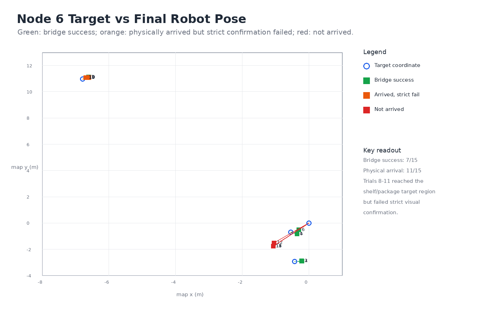
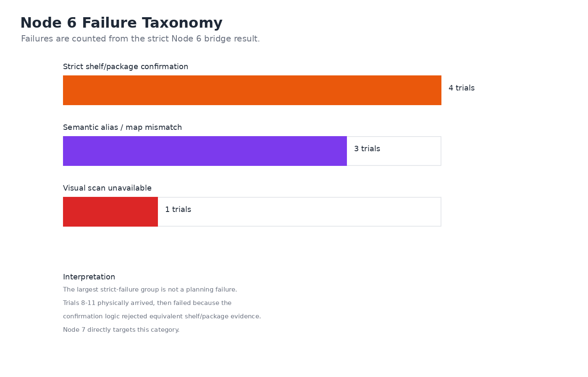

# Node 6 Final Simulation Evaluation

Date: 2026-06-13

## Dataset

Final CSV:

```text
data/node6_auto_trials_2026-06-13_final.csv
```

This final set contains 15 language-conditioned navigation trials. It keeps the stable 2026-06-12 trials 1-5 and 12-15, and replaces trials 6-11 with the 2026-06-13 rerun after AMCL/TF startup and timeout issues were corrected.

The rerun used:

```text
nav_timeout_sec:=900.0
--timeout-sec 900.0
```

`900.0` is required because `nav_timeout_sec` is declared as a double parameter.

## Final Metrics

| Metric | Result |
|---|---:|
| Total trials | 15 |
| Bridge `nav_result=success` | 7/15 |
| Final pose within 0.8 m success radius | 11/15 |
| Visual target marked visible | 11/15 |
| Mean final error over all trials | 0.697 m |

## Result Figures





## Metric Definitions

Node 6 intentionally reports both bridge-level success and physical arrival. These are different signals:

| Metric | Definition | Node 6 value | Interpretation |
|---|---|---:|---|
| `bridge_success` | The bridge returned `nav_result=success`. | 7/15 | End-to-end success under the original strict confirmation logic. |
| `navigation_arrived` | The final robot pose is within 0.8 m of the intended target coordinate. | 11/15 | Nav2 physically reached the target area in most evaluated cases. |
| `visual_grounded` | The model/semantic map produced a usable target or visible target evidence. | 11/15 visible, 7/15 accepted by strict logic | The main gap is semantic confirmation, not low-level navigation. |
| `task_success` | The robot arrived and the system accepted the visual/semantic confirmation. | 7/15 before Node 7 | This is the strict baseline that Node 7 improves. |

This distinction matters because Trials 8-11 are not Nav2 failures. They reached the shelf/package area, but the post-arrival confirmation rejected semantically equivalent evidence such as purple packages or cart-with-boxes.

## Parse / Grounding Methods

| Method | Count |
|---|---:|
| `visual_semantic_map` | 7 |
| `semantic_explore_visual_scan_failed` | 4 |
| `visual_map_failed` | 3 |
| `visual_scan_failed` | 1 |

## Per-Trial Summary

| Trial | Instruction | Bridge result | Parse method | Within radius | Final error |
|---:|---|---|---|---|---:|
| 1 | Go to the plant. | success | visual_semantic_map | True | 0.224 m |
| 2 | Move to the potted plant on the floor. | success | visual_semantic_map | True | 0.218 m |
| 3 | Navigate to the green plant near the chair. | success | visual_semantic_map | True | 0.214 m |
| 4 | Go to the black office chair. | success | visual_semantic_map | True | 0.234 m |
| 5 | Move to the chair near the robot. | success | visual_semantic_map | True | 0.234 m |
| 6 | Navigate to the chair beside the plant. | success | visual_semantic_map | True | 0.301 m |
| 7 | Go to the purple boxes. | success | visual_semantic_map | True | 0.235 m |
| 8 | Move to the right shelf with purple boxes. | failed | semantic_explore_visual_scan_failed | True | 0.225 m |
| 9 | Navigate to the shelf area containing purple packages. | failed | semantic_explore_visual_scan_failed | True | 0.232 m |
| 10 | Go to the shelf. | failed | semantic_explore_visual_scan_failed | True | 0.168 m |
| 11 | Move to the right shelf. | failed | semantic_explore_visual_scan_failed | True | 0.142 m |
| 12 | Navigate to the warehouse rack near the boxes. | failed | visual_map_failed | False | 1.839 m |
| 13 | Go to the object near the wall. | failed | visual_scan_failed | False | 2.062 m |
| 14 | Move to the package area. | failed | visual_map_failed | False | 2.062 m |
| 15 | Navigate to the target object. | failed | visual_map_failed | False | 2.062 m |

## Failure Taxonomy

| Failure class | Final count | Evidence | Status |
|---|---:|---|---|
| AMCL/TF startup mismatch | 0 in final CSV | Earlier preflight showed robot map pose in occupied cell when static `map -> odom` conflicted with AMCL. | Resolved by letting AMCL publish `map -> odom` and initializing with `/set_initial_pose`. |
| Start pose near obstacle / goal tolerance edge | 0 in final CSV | Intermediate run after shelf goal showed current pose free ratio about 92% and chair planning failure. | Node 7 material; fixed manually before final rerun. |
| Timeout on long shelf-to-chair path | 0 in final CSV | Earlier `nav_timeout_sec=240` was too short for slow simulated long-distance return. | Resolved for Node 6 by using `900.0`. |
| Visual confirmation too strict for shelf/right shelf | 4 | Trials 8-11 reached the target radius, but post-arrival scan rejected cart / purple boxes / purple packages as not being a visible shelf. | Main remaining Node 7 optimization target. |
| Semantic alias missing from map | 3 | Trials 12, 14, 15 failed with missing semantic-map matches for warehouse rack, package area, and cart with boxes in the older evaluation pass. | Alias table should be expanded or normalized in Node 7. |
| Visual scan target unavailable | 1 | Trial 13 failed with `visual_scan_spin_failed`. | Lower priority after current scan and timeout fixes. |
| Nav2 controller/planner failure | 0 in final CSV | No final-trial failure is attributed to controller or planner failure. | Not the current primary blocker. |

## Interpretation

Node 6 now has a reproducible integrated simulation evaluation with 15 trials. The navigation stack is usable after the AMCL/TF and timeout corrections: 11/15 trials ended within the configured success radius, and trials 8-11 physically arrived at the shelf/package area even though the bridge returned failure.

The remaining blocker is not primarily Nav2. The strongest Node 7 defect is semantic confirmation around shelf-like targets: the model can observe purple packages or a cart with purple boxes, but the confirmation logic still rejects the trial when the literal shelf is not visible. Node 7 should separate `navigation_arrived` from `visual_confirmed` and broaden shelf/package-area confirmation aliases.

## Poster-Ready Summary

Node 6 completed 15 language-conditioned Isaac Sim navigation trials using real-time camera input, local Qwen3-VL inference, semantic target mapping, and Nav2 execution. The strict bridge success rate was 7/15, while 11/15 trials physically reached the target radius. The four-trial gap exposed a clear system limitation: shelf/package-area tasks were navigationally successful but failed visual confirmation because the evaluator required literal shelf evidence instead of accepting semantically equivalent package-area cues. This finding directly motivates the Node 7 metric split and relaxed semantic confirmation improvement.

## Reproduction Commands

Regenerate the Node 6/7 result figures:

```bash
cd /home/bluepoisons/Desktop/FURP/VLN/ZhiruiSHEN-VLN
python3 src/analysis/plot_node6_node7_results.py
```

Rerun the full Node 6/7 online evaluation after Isaac Sim, `/scan`, Nav2, AMCL, and the VLN bridge are already running:

```bash
source /opt/ros/humble/setup.bash
cd /home/bluepoisons/Desktop/FURP/VLN/ZhiruiSHEN-VLN
source install/setup.bash
ros2 run vln_nav2_bridge node6_auto_trials -- \
  --output data/node7_online_trials_2026-06-15.csv \
  --timeout-sec 900.0 \
  --settle-sec 2.0
```
