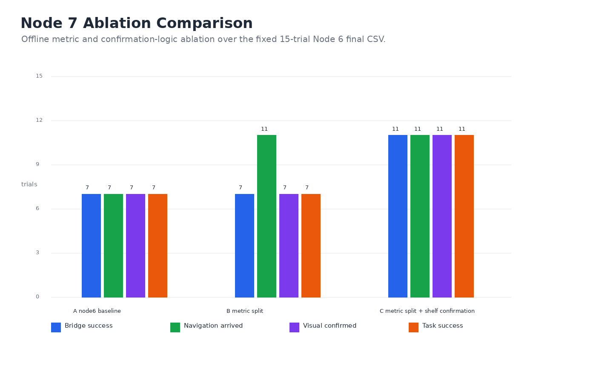

# Node 7 Ablation Report

Date: 2026-06-13

## Objective

Node 7 targets the main defect exposed by Node 6: shelf/right-shelf instructions reached the correct target radius, but the bridge still marked them failed because the post-arrival visual scan rejected cart / purple boxes / purple packages as not being a literal visible shelf.

The optimization has two parts:

1. Split result metrics into `navigation_arrived`, `visual_confirmed`, and `task_success`.
2. Add relaxed same-cluster confirmation for shelf/package-area targets after semantic exploration has already navigated to the known candidate.

## Code Changes

- `src/vln_nav2_bridge/vln_nav2_bridge/node6_auto_trials.py`
  - Adds CSV fields: `navigation_arrived`, `visual_confirmed`, `task_success`.
  - Computes `navigation_arrived` from final pose radius, not only bridge `nav_result`.
  - Prints separate summary lines for visual confirmation and task success.

- `src/vln_nav2_bridge/vln_nav2_bridge/text_to_pose_converter.py`
  - Adds semantic clusters for plant, chair, and shelf/package-area.
  - Groups `shelf`, `right shelf`, `warehouse rack`, `package area`, `cart with boxes`, `purple boxes`, `purple packages`, and `purple crates`.

- `src/vln_nav2_bridge/vln_nav2_bridge/vln_node_local.py`
  - Adds relaxed semantic confirmation after semantic exploration.
  - If the robot has arrived at a shelf/package semantic candidate and the scan evidence belongs to the same semantic cluster, the bridge records `semantic_explore_relaxed_confirm` and marks the task successful.

## Ablation Data

Input baseline:

```text
data/node6_auto_trials_2026-06-13_final.csv
```

Output:

```text
data/node7_ablation_2026-06-13.csv
```

The A/B/C ablation is an offline metric and confirmation-logic ablation over the fixed Node 6 final CSV. It does not imply that each variant was separately rerun through Isaac Sim, Nav2, and Qwen. This design isolates the effect of the Node 7 scoring and semantic-confirmation change while keeping the robot trajectories and model observations constant.

## Results

| Variant | Bridge success | Navigation arrived | Visual confirmed | Task success | Relaxed shelf confirmations |
|---|---:|---:|---:|---:|---:|
| A: Node 6 baseline | 7/15 | 7/15 | 7/15 | 7/15 | 0 |
| B: metric split | 7/15 | 11/15 | 7/15 | 7/15 | 0 |
| C: metric split + shelf confirmation | 11/15 | 11/15 | 11/15 | 11/15 | 4 |

Mean final error is unchanged at 0.697 m because Node 7 changes metric interpretation and visual confirmation logic, not the final poses.



## Interpretation

Metric split shows the key Node 6 undercount: four trials physically arrived at the shelf/package target but were hidden inside bridge-level failure. The relaxed shelf/package confirmation then converts those four cases into successful tasks because their visual evidence belongs to the same semantic cluster as the instruction.

The remaining 4/15 failures are not solved by this change. They come from older semantic-map alias or visual-scan failures involving `warehouse rack`, `object near the wall`, `package area`, and `target object`. Those should be handled separately by broader alias normalization or explicit object-disambiguation logic.

## Evidence Scope

| Evidence type | Status | Notes |
|---|---|---|
| Offline metric split | Complete | Computed from `data/node6_auto_trials_2026-06-13_final.csv`. |
| Offline relaxed semantic confirmation | Complete | Reclassifies Trials 8-11 when instruction and visual evidence share the shelf/package semantic cluster. |
| Safe-start/safe-goal occupancy validation | Complete | Static-map validation detects known unsafe starts and preserves safe default goals. |
| Full online rerun of all 15 trials with Node 7 enabled | Complete | `data/node7_online_trials_clean_2026-06-15.csv` and `docs/node7_online_clean_rerun_report.md` record the 15-trial clean online rerun. Strict task success is 8/15; physical arrival is 13/15. |
| Targeted online safe-recovery demonstration | Partial | The deterministic replay evidence remains in `docs/node7_safe_recovery_note.md`; the full online clean rerun above is the stronger current online evidence. |

## Safe Navigation Extension

Node 7 also implements the safe-start / safe-goal safeguards identified during Node 6 debugging.

Additional code changes in `src/vln_nav2_bridge/vln_nav2_bridge/vln_node_local.py`:

- Loads the static occupancy map through `SimpleOccupancyMap`.
- Adds configurable parameters:
  - `safe_map_validation_enabled`
  - `safe_start_enabled`
  - `safe_goal_enabled`
  - `safe_pose_check_radius_m`
  - `safe_pose_min_free_ratio`
  - `safe_nearest_free_search_m`
  - `dynamic_timeout_enabled`
  - `dynamic_timeout_min_sec`
  - `dynamic_timeout_sec_per_m`
- Checks the current odom pose before Nav2 execution. If the start pose is not safe, it navigates first to the nearest free candidate.
- Checks semantic goal poses before publishing Nav2 goals. If the goal pose is not safe, it replaces the target with the nearest free candidate.
- Dynamically expands the effective Nav2 timeout based on odom-to-goal distance, while never going below the configured `nav_timeout_sec`.

Offline validation output:

```text
data/node7_safe_navigation_checks_2026-06-13.csv
```

Additional targeted safe-start replay:

```text
data/node7_safe_recovery_replay_2026-06-15.csv
docs/node7_safe_recovery_note.md
```

| Case | Center state | Free ratio | Safe | Nearest free |
|---|---|---:|---|---|
| default plant | free | 1.000 | True | unchanged |
| default chair | free | 1.000 | True | unchanged |
| default shelf/package_area | free | 1.000 | True | unchanged |
| shelf edge start from 2026-06-13 | free | 0.920 | False | `(-6.727, 10.813)` |
| occupied start from 2026-06-12 | occupied | 0.451 | False | `(-1.290, -1.465)` |

The default semantic targets are not changed by the safe-goal logic. The two previously observed unsafe starts are both detected and receive nearest-free recovery candidates.

On 2026-06-15, Isaac Sim, `/scan`, Nav2, AMCL, and the required `base_link -> base_footprint` static TF were brought online. A first targeted safe-recovery attempt was cancelled because the long setup leg was too slow for a short evidence run, so the safe-recovery replay remains deterministic occupancy-map evidence. After resetting the robot, a full Node 7 clean online rerun completed all 15 evaluation instructions; see `docs/node7_online_clean_rerun_report.md`.

## Poster-Ready Summary

Node 7 improves the Node 6 baseline by separating physical arrival from visual confirmation and by relaxing shelf/package-area confirmation when the robot has reached the correct semantic target region. On the fixed 15-trial Node 6 dataset, this changes the measured offline task success from 7/15 to 11/15 without changing trajectories. In a clean live online rerun before observation-pose tuning, the stack achieved 13/15 physical arrivals and 8/15 strict visual task successes. A clean six-trial plant/chair targeted rerun after observation-pose tuning achieved 6/6 physical arrivals and 5/6 strict visual task successes. The improvement explains the original failure mode rather than hiding it: the robot often reaches the semantic target region, but strict visual confirmation can still fail when the camera no longer sees the target after arrival. Safe-start and safe-goal checks were also added to detect poses near obstacles before Nav2 execution, reducing the risk of planner failures caused by starting or stopping at map-edge cells.

## Remaining Work

- Plant/chair observation poses have been implemented and statically validated; see `docs/node7_observation_pose_note.md`. A clean reset targeted rerun is still required before claiming improved strict task success.
- Align reporting with R2R/VLN-CE practice: report final error, physical success, visual confirmation, strict task success, and path-efficiency metrics separately.
- Add multi-seed or repeated clean online reruns if the paper claims robustness rather than a single-run system demonstration.
- Broad references such as `object near the wall` and `target object` are now treated as `ambiguous_target` unless the instruction contains a concrete known semantic class. This avoids blind navigation to arbitrary objects and makes the failure mode explicit.

## Reproduction Commands

Regenerate the Node 6/7 figures:

```bash
cd /home/bluepoisons/Desktop/FURP/VLN/ZhiruiSHEN-VLN
python3 src/analysis/plot_node6_node7_results.py
```

Regenerate the safe-start recovery replay evidence:

```bash
cd /home/bluepoisons/Desktop/FURP/VLN/ZhiruiSHEN-VLN
/usr/bin/python3 src/analysis/run_node7_safe_recovery_trial.py --timeout-sec 900.0
```

Use `/usr/bin/python3` for ROS scripts because ROS 2 Humble `rclpy` is bound to Python 3.10. Conda Python versions will fail to import the Humble C extension.

Run a full online Node 7 evaluation after Isaac Sim, `/scan`, Nav2, AMCL, and `vln_node_local` are active:

```bash
source /opt/ros/humble/setup.bash
cd /home/bluepoisons/Desktop/FURP/VLN/ZhiruiSHEN-VLN
source install/setup.bash
ros2 run vln_nav2_bridge node6_auto_trials -- \
  --output data/node7_online_trials_2026-06-15.csv \
  --timeout-sec 900.0 \
  --settle-sec 2.0
```
